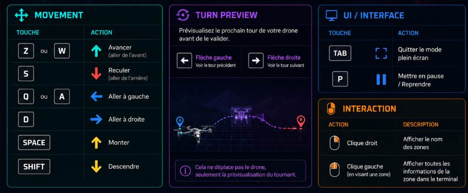

*This project has been created as part of the 42 curriculum by jtardieu*

# Fly-in

<table>
  <tr>
    <td>
      
    </td>
    <td align="center">
      <h2>Fly in to the moon</h2>
    </td>
  </tr>
</table>

# Description

Fly In is a graphical project from the 42 curriculum where the goal is to simulate a flying experience in a dynamic environment. The project focuses on real-time rendering, smooth user interaction, and precise control of movement, while handling visual feedback and performance constraints.

# Instructions

## 🚀 Installation

Clone the repository and build the project:

```bash
git clone <repository_url>
cd LeleILoko
make easy1
```

## Execution

| Commande | Description |
|---|---|
| `make install` | Install a dependesise |
| `make run` | Launch an asset map |
| `make easy1` | Launch the map for the topic. **easy**, 1 |
| `make easy2` | Launch the map for the topic. **easy**, 2 |
| `make easy3` | Launch the map for the topic. **easy**, 3 |
| `make medium1` | Launch the map for the topic. **medium**, 1 |
| `make medium2` | Launch the map for the topic. **medium**, 2 |
| `make medium3` | Launch the map for the topic. **medium**, 3 |
| `make hard1` | Launch the map for the topic. **hard**, 1 |
| `make hard2` | Launch the map for the topic. **hard**, 2 |
| `make hard3` | Launch the map for the topic. **hard**, 3 |
| `make chalenger` | Launch the map for the topic **chalenger** |
| `make lint` | launch the lint for all the projet |
| `make clean` | erase all of the cache project and temp folders |
| `make fclean` | make a clean and remove the venv |


## ⌨️ Controls
<p align="center">
  
</p>

## Change Asset

If you want to switch assets, two methods are possible.

### 🔹 Method 1 — via the command line

If you want to change the asset, use the following command:

```bash
uv run Flyin.py "the position of your asset"
```

### 🔹 Méthode 2 — via le Makefile

If you do not want to use this command, add a line to the `Makefile` with this:

```makefile
CONFIG ?= "the position of your asset"
```

⚠️ **Don't forget to comment out the old configuration.**

Then launch with:

```bash
make run
```
# 📚 Resources

## 📖 References

### 🎮 Library

<p align="center">
  
</p>

This project uses **Pyray**, the Python bindings for **Raylib**, a lightweight and beginner-friendly game development library.

I chose Raylib because its API is available in several programming languages, making the concepts and techniques learned during this project transferable to future projects, regardless of the language used.

| Resource | Link |
|---|---|
| 🌐 Raylib | [raylib.com](https://www.raylib.com/) |
| 🐍 Pyray | [github.com/electronstudio/raylib-python-cffi](https://github.com/electronstudio/raylib-python-cffi) |

### 🚁 3D Assets

The two drone models used in this project were downloaded from **Sketchfab**.

| Resource | Link |
|---|---|
| 🎨 Sketchfab | [sketchfab.com](https://sketchfab.com/) |

### 🌍 Environment Assets

The ground model and the skybox textures were obtained from **TextureLab**.

| Resource | Link |
|---|---|
| 🖼️ TextureLab | [texturelabs.org](https://texturelabs.org/) |


## 🤖 AI Usage

AI was used during this project for the following tasks:

| Tool | Task |
|---|---|
| 🧠 **Claude** | Helping with the friction calculations for the drone physics |
| 💬 **ChatGPT** | Guiding research and pointing towards relevant documentation/concepts |

No AI-generated code was used for [specify the parts kept fully manual, if relevant — e.g. rendering logic, input handling, map generation].

# Features

- 🎮 **3D visuals** — the whole simulation is rendered in 3D using Raylib/Pyray
- 🌬️ **Friction system** — drone physics include a friction model for realistic movement
- 🛠️ **Fully customizable** — maps, assets, and configuration can be entirely customized to fit your own setup